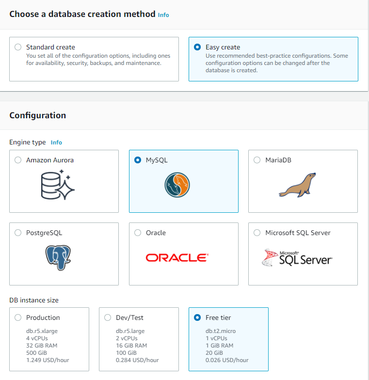
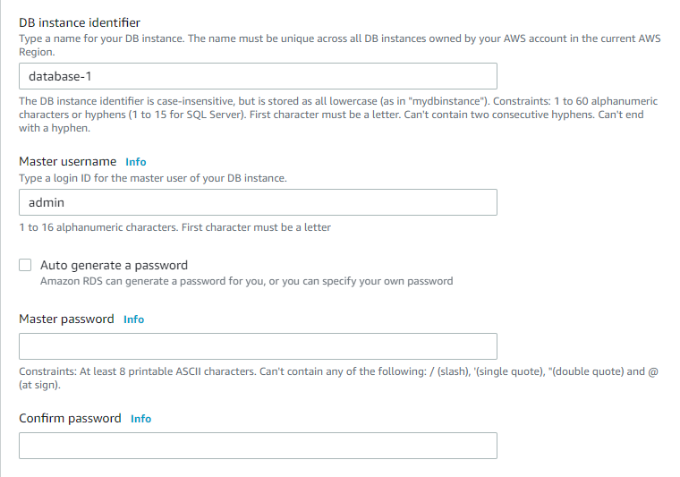
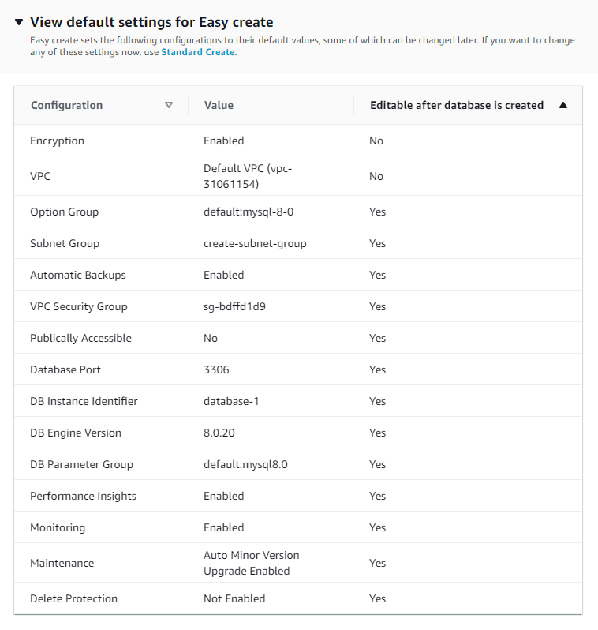

# Ninja's Thought Proccess

### Context 

Alfonso asked me to create a RDS SQL instance with these features:

1. automated daily backup of DB
1. available to use across multiple availability zones

### Steps

First off, I don't even know what is a RDS SQL, so I went to look up what Amazon RDS is. Before I started coding I first made a RDS with amazon console to get a general idea on what is *needed*. So I wennt through both the `easy create` and `standard create` to see everything I can change and the least i can change

> However if you want to see all the choices you have use the old database creation flow

After I got a general idea and created a RDS SQL instanc with the amazon console, I consulted the [terraform documentation](https://registry.terraform.io/providers/hashicorp/aws/latest/docs/resources/) and looked for `RDS` in the documentation and my intial goal is to duplicate this:

After you may run into errors, don't be afraid to look it up. Afterwords in the correct documentation I look for keywords that can lead to my desire end result Alfonso wanted; such as: id,backup and multi. Then I apply and plan the changes.

### Overview

1. Simulate what your application is doing by first working through the console or gui
1. Find documentation matching your needs
1. Tried to make changes!
1. repeat to step 2
